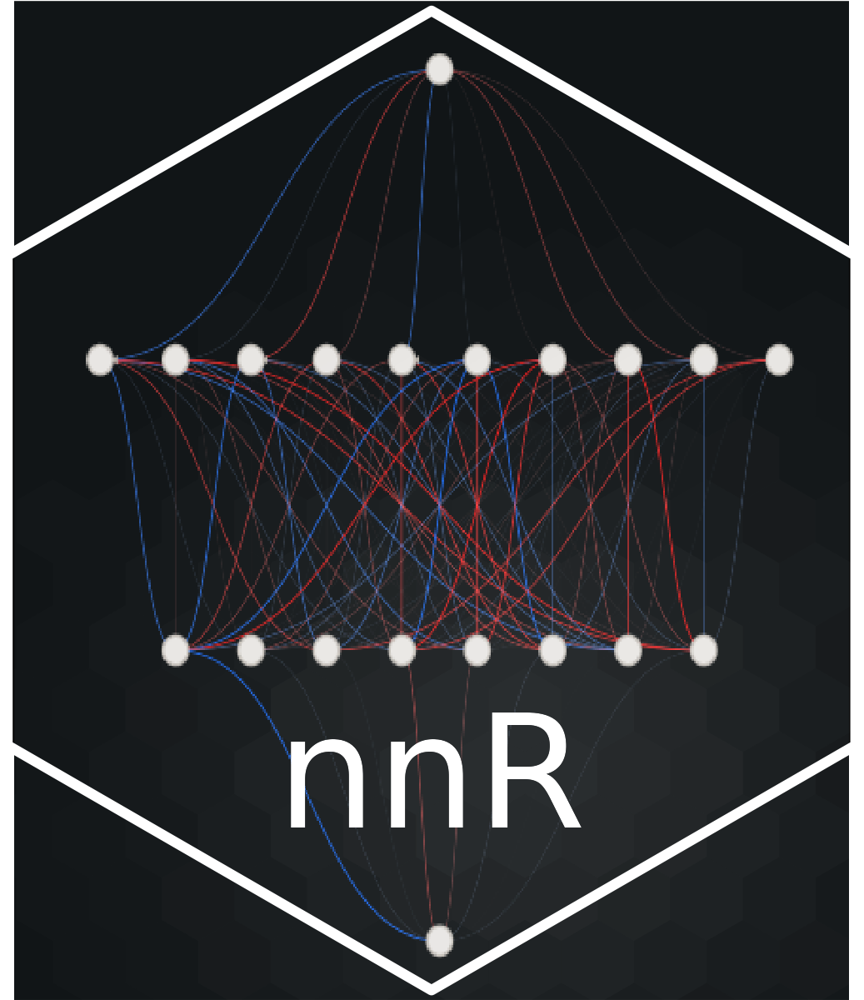

# nnR

### Neural Networks Made Algebraic

This is a repository which implements a certain neural network calculus.
This neural network calculus, or atleast the version implemented derives itself mainly from \<<https://doi.org/10.48550/arXiv.2402.01058>\>, which in turn is a highly modified version of that found in detail in \<<https://doi.org/10.1007/s10444-022-09970-2>\> and \<<https://doi.org/10.48550/arXiv.2310.20360>\>.

Our neural network calculus envisions neural networks as an ordered tuple of ordered pairs of $W$ and $b$, weight matrices and bias vectors.

We may compose neural networks as in Definition 2.6 in \<<https://doi.org/10.48550/arXiv.2402.01058>\>.

We may stack neural networks as in Definition 2.14 in \<<https://doi.org/10.48550/arXiv.2402.01058>\>.

We may take the sum of neural networks as in Definition 2.19 in \<<https://doi.org/10.48550/arXiv.2402.01058>\>.

We may take squares and products of neural networks as in Definition 2.24 and Definition 2.25 of respectively of \<<https://doi.org/10.48550/arXiv.2402.01058>\>.

We may take powers of neural networks as in Definition 2.26 in \<<https://doi.org/10.48550/arXiv.2402.01058>\>.

We may take neural network exponential, sines and cosines, as in Definitions 2.28, 2.29, and 2.30 respectively in \<<https://doi.org/10.48550/arXiv.2402.01058>\>.

We may implement the 1-D trapezoidal rule for integration as in Definitions 2.31 and 2.33 in \<<https://doi.org/10.48550/arXiv.2402.01058>\>.

Finallly, Norms, Maxima, and a maximum convolution type approximation for 1-D continuous functions is possible as in Definitions 2.35, 2.37, and 2.39 respectively in \<<https://doi.org/10.48550/arXiv.2402.01058>\>.
